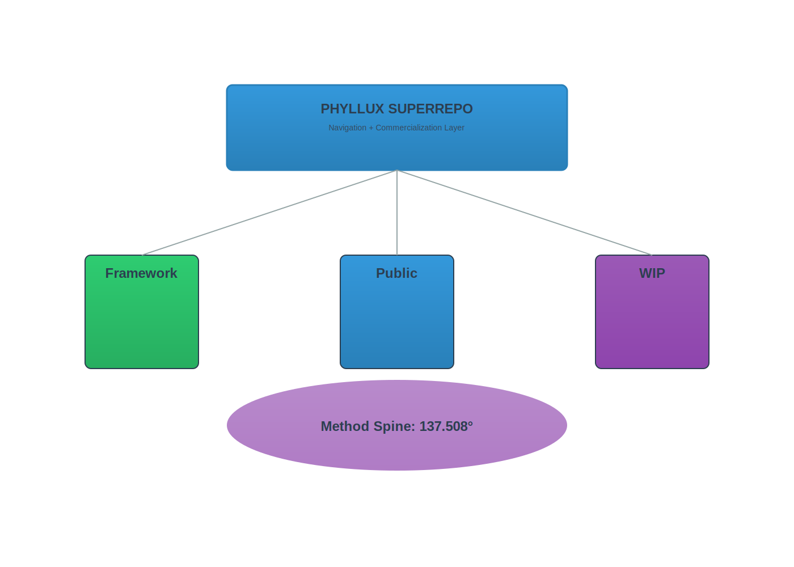
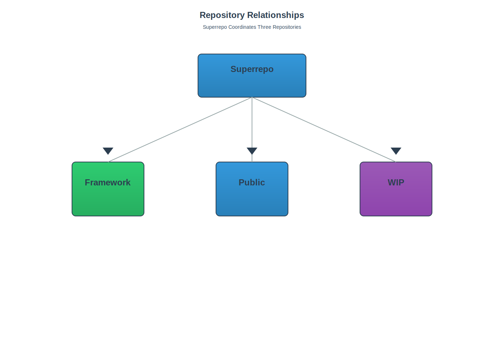

# Phyllux Superrepo

**Meta-coordination and commercialization layer for the Phyllux ecosystem**

## What This Is

The Phyllux Superrepo is a navigation and deal-making brain that sits above three existing repositories:

- **[biomimetic-inventions-public](https://github.com/phibronotchi-beep/biomimetic-inventions-public)** - Public demonstrations and prior art for Phyllux Mesh, Wave, Vault, and Core technologies
- **[phyllux-framework](https://github.com/phibronotchi-beep/phyllux-framework)** - Four-tier ethical licensing model (Pioneer/Mission-Aligned/Commercial/Free) and governance
- **[phyllux-inventions-wip](https://github.com/phibronotchi-beep/phyllux-inventions-wip)** - 350 systematic technology fusions across 12+ categories

This superrepo does NOT duplicate code, weaken IP protections, or create new claims. Instead, it:

- **Maps opportunities** across 350 fusions by TAM, maturity, and feasibility
- **Supports PPA filing** with cross-repo evidence mapping and claim coordination
- **Generates partner briefs** using tier-specific templates aligned with the 4-tier licensing model
- **Tracks commercialization** from inquiry → brief → negotiation → close
- **Coordinates ecosystem** growth while preserving defensive IP posture

## What This Is NOT

- ❌ Not a code repository (references existing code via links)
- ❌ Not a place to create new IP claims (that's for the PPA)
- ❌ Not a replacement for the three existing repos
- ❌ Not public-facing (contains deal pipeline and strategy)

## Critical Timeline

- **Late January 2026:** PPA filing deadline
- **Mid-February 2026:** Treatment begins
- **90-Day Sprint:** Everything must be usable by one person with AI assistance

## Quick Navigation

### Immediate Priorities (This Week)
- 📋 [PPA Evidence Map](strategy/PPA_EVIDENCE_MAP.md) - Cross-repo evidence for USPTO filing
- 🎯 [Top 5 Commercial Lanes](strategy/TOP_5_LANES.md) - Highest-value opportunities
- 🤝 [Partner Target List](strategy/PARTNER_TARGET_LIST.md) - Specific organizations to contact
- ⚡ [Urgent Briefs](partnerships/briefs/) - Pre-drafted Neuralink and SpaceX proposals

### Daily Operations
- 🎛️ [Control Panel](CONTROL_PANEL.md) - Daily status and next actions
- ⚡ [Fast-Track Workflow](partnerships/FAST_TRACK_WORKFLOW.md) - Idea → sent brief in 24 hours

### Before Treatment
- 📖 [Handoff Guide](HANDOFF_GUIDE.md) - Instructions for trusted helper (what NOT to touch)

### Strategy & Analysis
- 📊 [Opportunity Matrix](strategy/OPPORTUNITY_MATRIX.md) - All 350 fusions scored
- 💰 [Revenue Model](strategy/REVENUE_MODEL.md) - Deal value estimation by tier
- 🏢 [Partnership Playbook](partnerships/PARTNERSHIP_PLAYBOOK.md) - How to engage partners

### Ecosystem & Governance
- 🌟 [Vision](ecosystem/VISION.md) - Long-term ecosystem goals
- 🤖 [AI Collaboration Rules](ai-collaboration/CURSOR_RULES.md) - Safety guardrails
- ⚖️ [Governance Framework](ecosystem/GOVERNANCE_FRAMEWORK.md) - Decision-making structure

## Repository Roles



```
┌─────────────────────────────────────────────────────────────┐
│                   PHYLLUX SUPERREPO                         │
│         (Navigation + Commercialization Layer)              │
│                                                             │
│  • Opportunity scoring and prioritization                  │
│  • Partner brief generation and deal tracking              │
│  • PPA support and evidence coordination                   │
│  • Ecosystem orchestration and governance                  │
└─────────────────────────────────────────────────────────────┘
                           │
        ┌──────────────────┼──────────────────┐
        │                  │                  │
        ▼                  ▼                  ▼
┌───────────────┐  ┌───────────────┐  ┌───────────────┐
│   Framework   │  │    Public     │  │      WIP      │
│               │  │               │  │               │
│ • 4-tier      │  │ • Demos       │  │ • 350 fusions │
│   licensing   │  │ • Prior art   │  │ • Exploration │
│ • Governance  │  │ • Jan 7, 2026 │  │ • Maturity    │
│ • Templates   │  │   priority    │  │   pipeline    │
└───────────────┘  └───────────────┘  └───────────────┘
```



## Contact

**David Edward Sproule**  
Independent Inventor | Phyllux Technologies  
Alberta, Canada  
Email: phibronotchi@gmail.com

## License

This superrepo uses the same multi-license structure as phyllux-framework:
- Documentation: CC BY-SA 4.0
- Code (if any): MIT
- IP Notice: See individual repos for invention claims

**All inventions remain proprietary.** This repo coordinates commercialization; it does not weaken IP protections.

---

## Textless Diagram Workflow

This repository uses textless SVG versions of diagrams to avoid text-rendering issues in downstream tools and keep visuals clean. The textless images are shown first in Markdown documents, with labeled SVG versions available as links.

### Generating Textless Images

To generate textless SVG versions of all SVG diagrams:

```bash
python tools/generate_textless_from_svg.py --root . --suffix "-textless"
```

This will:
- Scan all SVG files recursively
- Remove all text elements (labels, titles, descriptions)
- Generate SVG files with the `-textless` suffix (e.g., `ecosystem-map-textless.svg`)

To preview what would be generated without creating files:

```bash
python tools/generate_textless_from_svg.py --root . --suffix "-textless" --dry-run
```

### Updating Markdown References

After generating textless images, update Markdown files to show textless images first:

```bash
python tools/update_markdown_image_references.py --root . --mode "inline-plus-link"
```

This will:
- Find all SVG image references in Markdown files
- For each SVG with a corresponding textless PNG, insert the textless image first
- Add a link to the labeled SVG version
- Preserve all existing alt text and surrounding content

To preview changes without modifying files:

```bash
python tools/update_markdown_image_references.py --root . --mode "inline-plus-link" --dry-run
```

**Note:** These tools only read SVG diagrams and write new image files, or modify Markdown image references. They do not modify any source code, legal documents, or IP claims.
